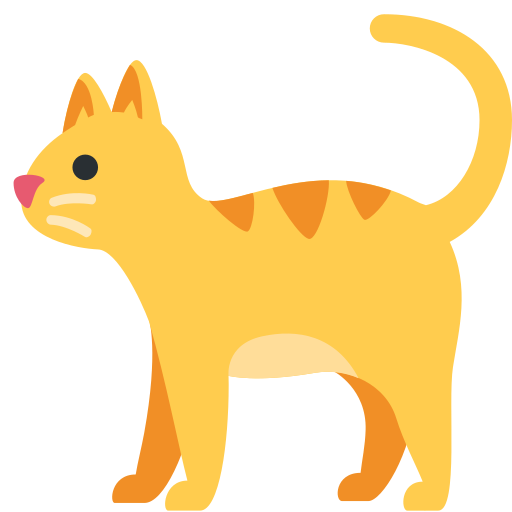

<p align="center">
  
</p>

# Kittens API

An API that provides random images of kittens.

- Live: https://kittens.stuxapis.net
- `GET /random` — redirect to a random kitten image
- `GET /random.json` — `{ "file": "<url>" }`
- `GET /randomfile` — random kitten image, served directly
- `GET /randomaf` — random kitten image, served as an attachment

## Open Source

The project is fully open source. It was originally forked from
[AlexFlipnote's Coffee API](https://github.com/AlexFlipnote/CoffeeAPI).

## Website

- Frameworks: [ModestaCSS](https://github.com/AlexFlipnote/ModestaCSS)
- Legal: [/legal](https://kittens.stuxapis.net/legal)

## Local development

```bash
pip install -r requirements.txt
cp config.json.example config.json
python index.py
```

Or use the bundled dev server, which forces dev-mode config for you:

```bash
./dev-server.sh      # Linux/macOS
dev-server.bat       # Windows
```

## Contributing

See [CONTRIBUTING.md](CONTRIBUTING.md).

## License

MIT — see [LICENSE](LICENSE).

## Copyright

(C) 2024 Stux.Group. All rights reserved.
